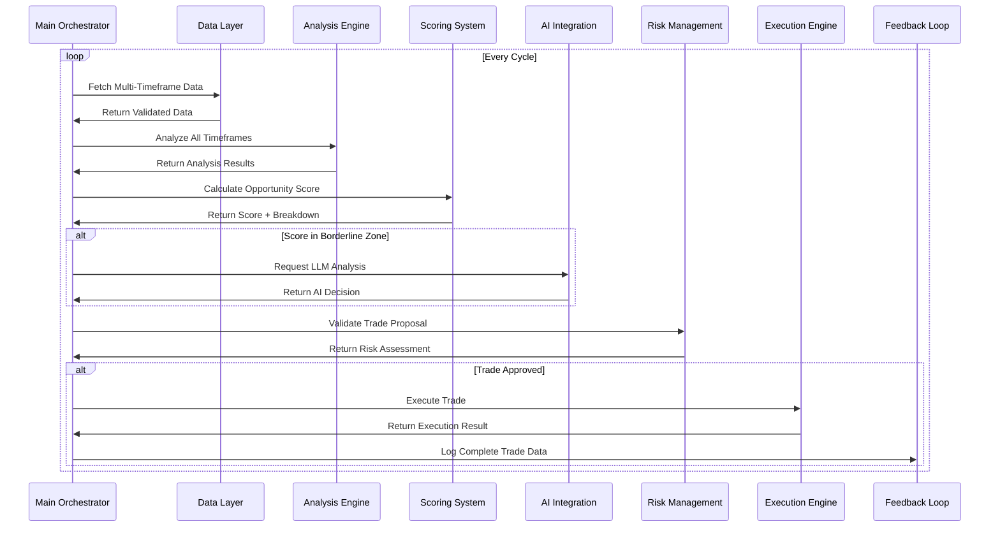

# Design Document

## Overview

The Advanced Multi-Timeframe Algorithmic Trading Bot is designed as a modular, scalable system that combines quantitative technical analysis with AI-enhanced decision making. The system follows a microservices-inspired architecture with clear separation of concerns, enabling independent testing, scaling, and maintenance of each component.

The core philosophy is "Safety First, Profits Second" - every design decision prioritizes capital preservation while maximizing risk-adjusted returns through sophisticated analysis and adaptive learning.

## Architecture

### High-Level Architecture

```mermaid
graph TB
    A[Main Orchestrator] --> B[Data Layer]
    A --> C[Analysis Engine]
    A --> D[Scoring System]
    A --> E[AI Integration]
    A --> F[Risk Management]
    A --> G[Execution Engine]
    A --> H[Monitoring System]
    A --> I[Feedback Loop]
    
    B --> B1[Data Fetcher]
    B --> B2[Storage Manager]
    B --> B3[Data Validator]
    
    C --> C1[Timeframe Analyzers]
    C --> C2[Pattern Detector]
    C --> C3[Context Engine]
    
    D --> D1[Score Calculator]
    D --> D2[Weight Manager]
    D --> D3[Regime Adapter]
    
    E --> E1[LLM Connector]
    E --> E2[Prompt Builder]
    E --> E3[Response Parser]
    
    F --> F1[Global Risk Manager]
    F --> F2[Circuit Breaker]
    F --> F3[Position Validator]
    
    G --> G1[Trade Executor]
    G --> G2[Position Manager]
    G --> G3[Order Optimizer]
    
    H --> H1[Health Checker]
    H --> H2[Logger]
    H --> H3[Alert System]
    
    I --> I1[Performance Tracker]
    I --> I2[Trade Analyzer]
    I --> I3[Parameter Optimizer]
```



### System Flow



## Components and Interfaces

### 1. Data Layer

#### Data Fetcher (`data/fetcher.py`)
```python
class MultiTimeframeFetcher:
    async def fetch_ohlcv(self, symbol: str, timeframes: List[str], limit: int) -> Dict[str, pd.DataFrame]
    async def fetch_market_context(self, symbol: str) -> MarketContext
    def validate_data_quality(self, data: pd.DataFrame) -> ValidationResult
```

**Key Features:**
- Asynchronous data fetching for multiple timeframes simultaneously
- Intelligent retry logic with exponential backoff
- Rate limit management with request queuing
- Data quality validation (gaps, outliers, completeness)

#### Storage Manager (`data/storage.py`)
```python
class StorageManager:
    def cache_data(self, key: str, data: Any, ttl: int) -> None
    def get_cached_data(self, key: str) -> Optional[Any]
    def store_trade_record(self, trade: TradeRecord) -> None
    def get_historical_performance(self, lookback_days: int) -> PerformanceData
```

**Key Features:**
- Redis-based caching with configurable TTL
- Fallback to file-based storage for persistence
- Compressed storage for large datasets
- Automatic cache cleanup and maintenance

### 2. Analysis Engine

#### Timeframe Analyzers (`analysis/tf_analyzers.py`)
```python
class TimeframeAnalyzer:
    def analyze_1d(self, data: pd.DataFrame) -> TimeframeAnalysis
    def analyze_4h(self, data: pd.DataFrame) -> TimeframeAnalysis
    def analyze_1h(self, data: pd.DataFrame) -> TimeframeAnalysis
    def analyze_15m(self, data: pd.DataFrame) -> TimeframeAnalysis

@dataclass
class TimeframeAnalysis:
    trend_direction: str
    trend_strength: float
    momentum: float
    support_resistance: List[float]
    pattern_detected: Optional[str]
    confidence: float
```

**Key Features:**
- Specialized analysis for each timeframe
- Normalized indicators for consistent scoring
- Pattern recognition with confidence levels
- Support/resistance level identification

#### Confluence Engine (`analysis/confluence.py`)
```python
class ConfluenceEngine:
    def calculate_confluence(self, analyses: Dict[str, TimeframeAnalysis]) -> ConfluenceScore
    def detect_divergences(self, analyses: Dict[str, TimeframeAnalysis]) -> List[Divergence]
    def assess_alignment(self, analyses: Dict[str, TimeframeAnalysis]) -> AlignmentScore
```

### 3. Scoring System

#### Dynamic Scorer (`scoring/scorer.py`)
```python
class DynamicScorer:
    def calculate_score(self, 
                       mtf_analysis: Dict[str, TimeframeAnalysis],
                       market_context: MarketContext,
                       regime: MarketRegime) -> ScoringResult

@dataclass
class ScoringResult:
    total_score: float
    breakdown: Dict[str, float]
    confidence: float
    regime_adjusted: bool
```

**Scoring Components:**
- **MTF Structure (35%)**: Trend alignment across timeframes
- **Technical Confluence (25%)**: Pattern and indicator alignment
- **Market Context (20%)**: Regime, correlation, volume analysis
- **Risk Metrics (20%)**: Risk/reward ratio, stop placement quality

### 4. AI Integration

#### LLM Connector (`llm/connector.py`)
```python
class LLMConnector:
    async def analyze_trade(self, 
                           trade_proposal: TradeProposal,
                           context: MarketContext,
                           analysis: Dict[str, TimeframeAnalysis]) -> LLMResponse

@dataclass
class LLMResponse:
    decision: str  # APPROVE, REJECT, MODIFY
    confidence: float
    reasoning: str
    identified_risks: List[str]
    suggested_modifications: Optional[Dict[str, Any]]
    cost: float
```

**Key Features:**
- Structured JSON prompts for consistent responses
- Cost tracking and budget management
- Response validation and error handling
- Caching for similar queries

### 5. Risk Management

#### Global Risk Manager (`risk_management/global_risk_manager.py`)
```python
class GlobalRiskManager:
    def validate_trade(self, trade: TradeProposal) -> RiskValidation
    def calculate_position_size(self, 
                               score: float,
                               regime: MarketRegime,
                               portfolio_heat: float) -> float
    def check_drawdown_limits(self) -> DrawdownStatus
    def get_portfolio_heat(self) -> float

@dataclass
class RiskValidation:
    approved: bool
    reason: str
    max_position_size: float
    warnings: List[str]
```

**Risk Controls:**
- Daily drawdown limits (2%)
- Portfolio heat management (max 6%)
- Correlation limits (max 0.8)
- Position size limits (max 30% per symbol)
- Circuit breakers for consecutive losses

### 6. Execution Engine

#### Trade Executor (`execution/trader.py`)
```python
class TradeExecutor:
    async def execute_trade(self, trade: TradeProposal) -> ExecutionResult
    def simulate_slippage(self, trade: TradeProposal) -> float
    def optimize_execution(self, trade: TradeProposal) -> ExecutionStrategy

@dataclass
class ExecutionResult:
    success: bool
    fill_price: float
    slippage: float
    execution_time: datetime
    order_id: str
    fees: float
```

## Data Models

### Core Data Structures

```python
@dataclass
class TradeProposal:
    symbol: str
    direction: str  # LONG, SHORT
    entry_price: float
    stop_loss: float
    take_profits: List[float]
    position_size: float
    score: float
    timeframe_analysis: Dict[str, TimeframeAnalysis]
    created_at: datetime

@dataclass
class MarketContext:
    regime: MarketRegime
    volatility: float
    correlation_matrix: Dict[str, Dict[str, float]]
    volume_profile: VolumeProfile
    macro_events: List[MacroEvent]

@dataclass
class TradeRecord:
    id: str
    proposal: TradeProposal
    execution: ExecutionResult
    outcome: TradeOutcome
    llm_interaction: Optional[LLMResponse]
    market_conditions: MarketContext
    performance_metrics: PerformanceMetrics
```

### Configuration Models

```python
@dataclass
class TradingConfig:
    # Scoring weights
    mtf_structure_weight: float = 0.35
    technical_confluence_weight: float = 0.25
    market_context_weight: float = 0.20
    risk_metrics_weight: float = 0.20
    
    # Risk parameters
    max_daily_drawdown: float = 0.02
    max_portfolio_heat: float = 0.06
    max_position_per_symbol: float = 0.30
    
    # LLM parameters
    llm_score_threshold_min: float = 60.0
    llm_score_threshold_max: float = 75.0
    max_daily_llm_cost: float = 50.0
    
    # Execution parameters
    max_slippage_tolerance: float = 0.002
    position_scaling_levels: int = 3
```

## Error Handling

### Exception Hierarchy

```python
class TradingBotException(Exception):
    """Base exception for trading bot"""
    pass

class DataException(TradingBotException):
    """Data-related errors"""
    pass

class AnalysisException(TradingBotException):
    """Analysis-related errors"""
    pass

class RiskException(TradingBotException):
    """Risk management errors"""
    pass

class ExecutionException(TradingBotException):
    """Trade execution errors"""
    pass

class LLMException(TradingBotException):
    """LLM integration errors"""
    pass
```

### Error Handling Strategy

1. **Graceful Degradation**: System continues operating with reduced functionality
2. **Circuit Breakers**: Automatic pausing when error thresholds are exceeded
3. **Retry Logic**: Exponential backoff for transient failures
4. **Fallback Mechanisms**: Alternative data sources and execution paths
5. **Comprehensive Logging**: Detailed error tracking for debugging

## Testing Strategy

### Unit Testing
- **Data Layer**: Mock API responses, test data validation
- **Analysis Engine**: Test with known market patterns
- **Scoring System**: Verify score calculations with edge cases
- **Risk Management**: Test all risk limits and circuit breakers
- **LLM Integration**: Mock LLM responses, test parsing

### Integration Testing
- **End-to-End Workflows**: Complete trading cycles
- **API Integration**: Real Binance API testing (testnet)
- **Database Operations**: Storage and retrieval testing
- **Error Scenarios**: Network failures, API errors

### Performance Testing
- **Load Testing**: Multiple symbols, high-frequency data
- **Memory Usage**: Long-running performance monitoring
- **Latency Testing**: Execution speed optimization

### Advanced Backtesting Framework

#### Phase 1: Basic Backtesting (Current Implementation Enhancement)
```python
class BasicBacktestEngine:
    def run_basic_backtest(self, 
                          start_date: datetime,
                          end_date: datetime,
                          symbols: List[str],
                          config: BacktestConfig) -> BasicBacktestResult

@dataclass
class BasicBacktestResult:
    # Core Performance Metrics
    total_return: float
    profit_factor: float
    win_rate: float
    max_drawdown: float
    roi: float
    
    # Trade Statistics
    total_trades: int
    winning_trades: int
    losing_trades: int
    avg_win: float
    avg_loss: float
    
    # Risk Metrics
    sharpe_ratio: float
    calmar_ratio: float
    max_consecutive_losses: int
    
    # Execution Metrics
    total_commissions: float
    total_slippage: float
    avg_execution_time: float
    
    # Detailed Analysis
    trade_details: List[TradeRecord]
    equity_curve: pd.DataFrame
    monthly_returns: Dict[str, float]
    symbol_performance: Dict[str, SymbolPerformance]
```

#### Phase 2: Advanced Backtesting (Post LLM Integration)
```python
class AdvancedBacktestEngine(BasicBacktestEngine):
    def run_advanced_backtest(self, 
                             config: AdvancedBacktestConfig) -> AdvancedBacktestResult

@dataclass
class AdvancedBacktestResult(BasicBacktestResult):
    # LLM Integration Metrics
    llm_calls_made: int
    llm_total_cost: float
    llm_value_added: float
    llm_accuracy: float
    
    # Regime Analysis
    regime_performance: Dict[MarketRegime, RegimePerformance]
    regime_transitions: List[RegimeTransition]
    
    # Advanced Risk Metrics
    var_95: float
    cvar_95: float
    kelly_criterion: float
    information_ratio: float
    
    # Walk-Forward Analysis
    walk_forward_results: List[WalkForwardPeriod]
    parameter_stability: Dict[str, float]
```

#### Backtesting Configuration
```python
@dataclass
class BacktestConfig:
    # Time Period
    start_date: datetime
    end_date: datetime
    symbols: List[str]
    
    # Capital Management
    initial_capital: float = 100000.0
    position_size_pct: float = 0.20  # 20% per position
    max_positions: int = 10
    
    # Entry/Exit Rules
    min_score_threshold: float = 68.0
    stop_loss_pct: float = 0.02  # 2%
    take_profit_pct: float = 0.06  # 6%
    
    # Execution Simulation
    commission_rate: float = 0.001  # 0.1%
    slippage_model: SlippageModel = SlippageModel.REALISTIC
    execution_delay_ms: int = 100
    
    # Risk Management
    max_daily_drawdown: float = 0.02
    max_portfolio_heat: float = 0.06
    
    # Data Configuration
    timeframes: List[str] = field(default_factory=lambda: ['1d', '4h', '1h', '15m'])
    warmup_periods: int = 200
    
    # Performance Targets
    target_win_rate: float = 0.60  # 60%
    target_profit_factor: float = 2.0
    target_sharpe: float = 1.5
```

### Test Data Management
- **Historical Data**: Curated datasets for consistent testing
- **Edge Cases**: Market crashes, flash crashes, low liquidity
- **Regime Testing**: Bull markets, bear markets, ranging markets

## Performance Considerations

### Optimization Strategies

1. **Asynchronous Operations**: Parallel data fetching and analysis
2. **Caching Strategy**: Multi-level caching (memory, Redis, disk)
3. **Data Compression**: Efficient storage of historical data
4. **Connection Pooling**: Reuse of API connections
5. **Batch Processing**: Group similar operations

### Scalability Design

1. **Horizontal Scaling**: Multiple instances with coordination
2. **Resource Management**: Dynamic resource allocation
3. **Load Balancing**: Distribute symbols across instances
4. **Database Sharding**: Partition data by symbol or time

### Monitoring and Metrics

```python
@dataclass
class SystemMetrics:
    # Performance metrics
    avg_analysis_time: float
    avg_execution_time: float
    memory_usage: float
    cpu_usage: float
    
    # Trading metrics
    daily_pnl: float
    win_rate: float
    profit_factor: float
    current_drawdown: float
    
    # System health
    uptime: float
    error_rate: float
    api_success_rate: float
    data_quality_score: float
```

This design provides a robust, scalable foundation for the advanced trading bot while maintaining flexibility for future enhancements and optimizations.